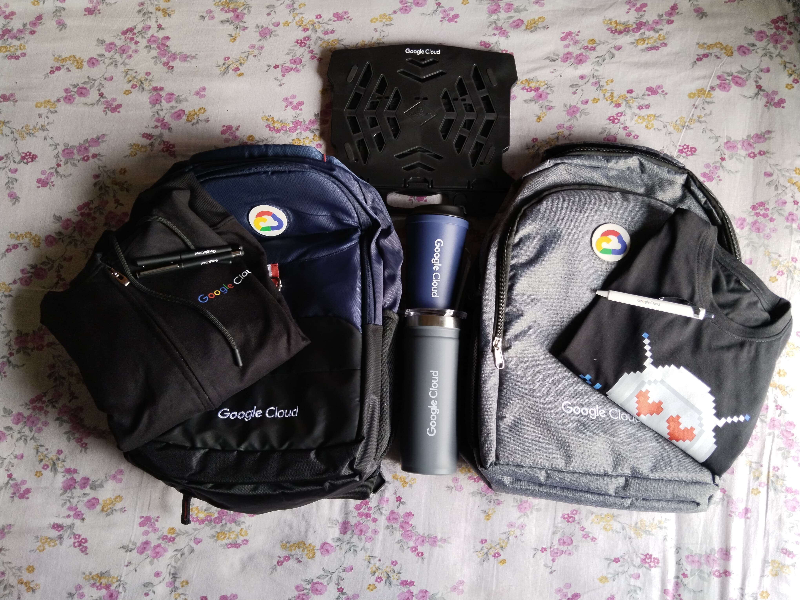

# 🕹️ Google Cloud Arcade 2024 (July–Dec Edition)

I participated in the **Google Cloud Arcade 2024** challenge and successfully completed the labs and quests — earning hands-on experience and some awesome swag!

## 🌩️ Tracks Completed
- Cloud Engineering
- GenAI / ML
- Infrastructure & Security

## 📜 Google Cloud Skills Boost Profile
[🔗 View my public profile](https://www.cloudskillsboost.google/public_profiles/7f08737e-732a-4401-bf79-af10a245d2c9)

## 📦 Swag Unboxing Video
🎥 [Watch on YouTube](https://www.youtube.com/watch?v=MMLOnEt5uQs)

## 💼 LinkedIn Post:
[🔗 View my LinkedIn profile](https://www.linkedin.com/posts/puskarsarkar_cloudarcade-googlecloud-cloudarcade-activity-7318333606228123648-r9cb?utm_source=share&utm_medium=member_desktop&rcm=ACoAAFgwIkcBq9XBIQQQXWzVc9ad8N2_TxU9Izs)

## 🧠 Skills Gained
- Cloud Infrastructure setup
- Generative AI integrations
- IAM, GCP CLI, BigQuery, and more

## 📸 Swag Preview

## 🚀 Thanks to
Google Cloud & Qwiklabs for an amazing learning experience!

